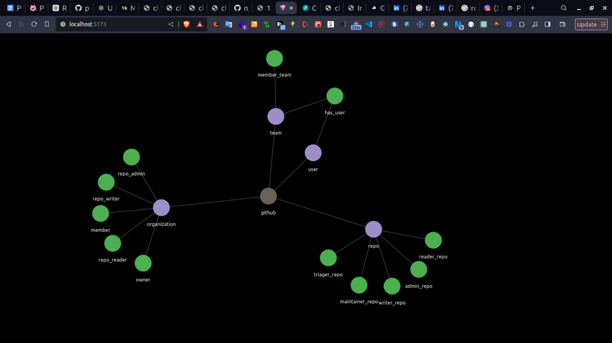

# ReBAC Policy Visualized

This project demonstrates a visualization of ReBAC (Relationship-Based Access Control) policies.

## Sample App Demo



## Backend Setup

1. Navigate to the `backend` directory:
   ```bash
   cd backend
   ```

2. Create a virtual environment (here named `env`):
   ```bash
   python -m venv env
   ```

3. Activate the virtual environment:
   ```bash
   source env/bin/activate
   ```

4. Install the required dependencies from `requirements.txt`:
   ```bash
   pip install -r requirements.txt
   ```

5. Set up the environment variables. Copy `.env.example` to create `.env`:
   ```bash
   cp .env.example .env
   ```

   - Add your Permit API key to the `.env` file.

6. Run the backend application:
   ```bash
   uvicorn main:app --reload
   ```

## Frontend Setup

1. Navigate to the `frontend` directory:
   ```bash
   cd frontend
   ```

2. Install the frontend dependencies (using `pnpm`):
   ```bash
   pnpm install
   ```

3. Serve the frontend application:
   ```bash
   pnpm dev
   ```
